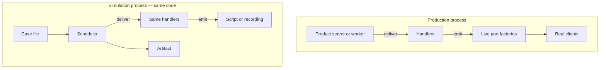
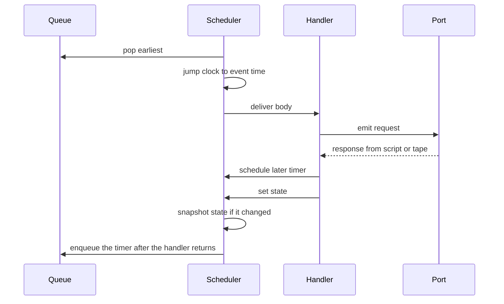

# Simulation SDK

A plan for a Python library that ships inside a product and stays quiet there, and that runs that same product, in a separate process, against a scripted or recorded outside world.

This document is the spec. The package in this repository is the implementation. Nothing here is published.

Working title: **seam**. The name is not decided. It is used so the contracts have a concrete word. `GRAFT` is already taken by unrelated projects and is not available. Renaming before any release is a search-and-replace of the module, the `SEAM_` environment prefix, and the `seam-case` / `seam-artifact` / `seam-tape` format strings.

The file format is version `1`. A later version must bump that number. A runner refuses a version it does not know. It does not guess.

---

## How to read this

1. Sections 1–3 say what the library is, what it refuses to be, and which existing systems it is not.
2. Sections 4–7 are the high-level architecture: two modes, one binary, what an author wires up.
3. Section 8 is the low-level architecture: clock, seed, queue, scheduler, ports, guards.
4. Sections 9–12 are the contracts: case file in, tape in, artifact out, process exit.
5. Sections 13–17 are the proof that v1 is done, the line around v1, the decisions, and the build order.

The normative examples were canonicalized with CPython `json.dumps(..., ensure_ascii=True, sort_keys=True, separators=(",", ":"), allow_nan=False)` and hashed with SHA-256. Pretty-printed JSON in this document is for reading. The bytes that the tests pin are the canonical form, given in full where a digest is claimed.

---

## 1. What this is

A product is a function of its state and of whatever the outside world just did. The outside world is other services, a clock, and a source of randomness. This library is the boundary between those.

The product names that boundary. A checkout has `payments` and `email`. A support tool has `mailbox` and `crm`. The library does not know what the names mean. It knows a name, a request, and a response.

The same handlers run in two modes.

- In production, a port is the real client. The simulation runner is not started. Recording is off unless someone turns it on.
- In a simulation, the process is seeded, time is a virtual clock, and a port never touches the network. Replies come from a script, or from a recording cut off at a chosen instant.

A simulation is one process. The clock does not tick. It jumps to the next event. The scheduler is single-threaded. When the run stops, there is one artifact. A grader is a pure function over that artifact. The first graders are structural: this call happened, it happened once, this timer fired, this field in the final state is this value.

Generality is the boundary. The library does not understand anyone's pipeline. If a behavior cannot be written as arrivals, timers, and port replies, it is not a v1 case.

## 2. What this is not

- Not a simulator that runs inside the production process. Production stays production. A simulation is a different start of the same code.
- Not a hypervisor. Calls that do not go through a port are not intercepted by a virtual machine. The obvious standard-library leaks fail the run. That is a guard, not a sandbox.
- Not a traffic mirror. Replaying HTTP at a real service still charges, sends, and writes, unless that service was built to refuse them.
- Not a multi-host network simulator. One product process, one queue.
- Not a web framework. The product owns the listening socket in production. The library never opens one.
- Not a judge. No model grades a run in v1. A structural check or a pure Python function does.
- Not a domain library. There is no type for an order, a ticket, a user, or a message. Those are JSON the product defines.

## 3. Related work

Four families already exist. None of them is a library any product can import, leave inside the production binary, and then run as a seeded simulation of its own pipeline.

**Deterministic simulation of a system written for it.** [FoundationDB](https://apple.github.io/foundationdb/testing.html) runs a whole cluster as actors in one thread. Flow replaces the network, the disk, and time. A seed replays a failure. Their own numbers put simulated time at about ten times real time. [TigerBeetle's VOPR](https://docs.tigerbeetle.com/about/vopr/) runs the production database against a stubbed clock, network, and disk. The seed plus the git commit replays a bug. Time is sped up. The cluster is deterministic both in its decisions and, by design, in the bytes on disk ([protocol-aware DST](https://tigerbeetle.com/blog/2026-08-20-protocol-aware-dst/)). This only works because those systems were written against the simulated interfaces. An existing application does not drop in.

**A runtime that pretends to be the real one.** [madsim](https://github.com/madsim-rs/madsim) replaces Tokio, tonic, and a few clients. Built normally, the crates are the real ones. Built with `RUSTFLAGS="--cfg madsim"`, the same code runs on a simulated clock and network. [Turmoil](https://github.com/tokio-rs/turmoil) runs many hosts in one thread and injects latency, loss, partitions, crashes, and torn writes under a seed. Right shape. Locked to Rust and to that runtime. Not "any product."

**A hypervisor under an unchanged binary.** [Antithesis](https://antithesis.com/docs/resources/deterministic_simulation_testing/) runs containers on a deterministic machine. Their hypervisor, the Determinator, started from bhyve. Time, randomness, and the network are theirs. The outside world is unreachable. A bug replays. The [SDK](https://antithesis.com/docs/using_antithesis/sdk/) is safe to ship because it detects their environment and otherwise becomes a no-op (or a log line, or a shim). No-op functions still evaluate their arguments, and the SDK can be compiled out. That shipping pattern is what we copy. The platform is not. It is closed, it is a fleet of virtual machines, and it looks for concurrency bugs. External dependencies still have to be mocked. [OpenThesis](https://github.com/openthesis/openthesis) is an open hypervisor in Go, still under construction, and it needs Linux and KVM. The TCG backend is deterministic and slow (about 100 states a minute). Firecracker is faster (about 1200) and fully deterministic only with host kernel patches; without them, KCOV edge determinism is about 99 percent. That is a virtual machine. This project is a library.

**Copy the bytes.** [GoReplay](https://goreplay.org/shadow-testing/) captures HTTP and sends a copy at a candidate. It is not on the request path. It also does not simulate time, a second step, or a side effect. Their own docs tell the operator to point the copy at an isolated target and to disable payments, email, and writes. A successful HTTP status is not a correct outcome. A recording in this library is different: the product runs, the port does not, and the response is the recorded one, cut off so the future is invisible.

The gap is the importable boundary. Inert in production. A separate seeded run. Ports instead of a hypervisor, and instead of a mirror.

## 4. High-level architecture



One code path. Two processes. The production process never loads a case. The simulation process never calls a live factory.

The product gets four operations, in both modes.

| Call | Production | Simulation |
|---|---|---|
| `now()` | Wall clock, as integer nanoseconds | Virtual clock, integer nanoseconds |
| `rand_u64()` / `rand_below()` / `id()` | OS entropy | A counter stream from the case seed |
| `emit(port, request)` | Call the live factory's client. Return its response | Never call the factory. Return the script or tape response |
| Inbox | The product calls `deliver(handler, body)` from its own server | The scheduler delivers arrivals and timers |

There is no `sleep`. Time moves only when the scheduler jumps to the next event. A handler that wants something to happen later calls `schedule_at` or `schedule_after`.

Inbound work is an event with a handler name and a JSON body. Outbound work is a port call. That split is the whole model.



The handler runs to completion. It does not yield. A timer scheduled during the handler is not delivered until the handler returns. A port reply is data, returned immediately. It does not enqueue a new inbound event. Inbound events come from the case, or from `schedule_*`.

Stopping is one of three things. The queue is empty (quiescence). The next event would pass a deadline. A handler calls `stop(name)`. There is no "run until it looks done."

## 5. The two modes

### Production

`SEAM_SIM` is unset or `0`. The product builds a `Runtime`, registers port factories and handlers, calls `start_live()`, and then runs its own server.

`start_live()` refuses to run if `SEAM_SIM=1` or if `SEAM_CASE` is set. A case file sitting in the environment of a production process is a mistake, and it must not be ignored.

The first `emit` on a port calls that port's factory once and caches the client. A port that is never used is never constructed. `deliver` invokes the handler on the caller's thread. The library does not add a lock. Production concurrency is the product's, as it was before.

`now()` reads the wall clock. `rand_u64()` reads the operating system. Neither is seeded. A production run is not reproducible, and the library does not pretend it is.

Recording is off. `SEAM_RECORD=1` appends one JSON line per port call to the path in `SEAM_ARTIFACT`, which in live mode is the tape path. If that write fails, the `emit` fails. A partial tape is a lie. Recording is a copy of production traffic. It will contain customer data. The library does not redact. Redaction is domain-specific, and doing it inside the library would mean understanding the product. The product may pass a `redact(port, request, response)` hook. If it does not, the raw JSON is stored. The default is off.

There is no simulation assertion API in the product binary. Assertions live in the case file and in grader functions, which production does not load. The Antithesis lesson we keep is "safe to ship." We do not keep a set of no-op assertion calls whose arguments still run.

### Simulation

`SEAM_SIM=1`, plus a namespace, plus a case path. The product's `__main__` sees the flag and calls `seam.main(runtime)` instead of serving.

Preconditions, all checked before the first event. Any failure refuses the run. Exit code 3. No handler has run.

- The namespace matches the sim pattern, and it equals the namespace written in the case.
- Every registered port appears in the case, and every port in the case is registered. No extra, no missing.
- No live factory has been called. Sim mode never calls one.
- The case version is 1, the JSON parses, and the schema checks in section 9 pass.
- Guards are installed.

The clock starts at `clock.start_ns`. Arrivals are enqueued. The loop in section 8 runs until the stop condition. The artifact is sealed, then graded. Graders cannot change the digest.

One simulation per process. A second `run` in the same process is refused. Import caches and a patched standard library make a second run a different program. The byte-stable test starts two processes.

## 6. What the product author does

```python
from seam import Runtime, in_sim, main

def build() -> Runtime:
    rt = Runtime()
    rt.port("payments", factory=make_payments)  # zero-arg, not called yet
    rt.port("email", factory=make_email)
    rt.on("message", on_message)
    rt.on("remind", on_remind)
    return rt

def entry() -> int:
    rt = build()
    if in_sim():
        return main(rt)          # reads the env, runs the case, writes the artifact
    rt.start_live()
    return serve(rt)             # the product's server, not ours
```

A handler:

```python
def on_message(ctx, body):
    decision = ctx.emit("payments", {"amount": body["amount"]})
    if decision["status"] == "declined":
        ctx.set_state({"order": {"status": "declined"}})
        return
    ctx.set_state({"order": {"status": "pending"}})
    ctx.schedule_after(3_600_000_000_000, "remind", {"amount": body["amount"]}, name="remind-once")
```

The author does not write a simulator. They write the ports they already had, as factories, and they take time and randomness from `ctx` instead of from the standard library.

## 7. Adoption cost

This is the cost. It is not optional, and a hypervisor would be the alternative if a team will not pay it.

- Handlers that the simulation should cover call `ctx.now()`, `ctx.rand_u64()`, `ctx.id()`, and `ctx.emit()`. Direct `time.time`, `random`, `uuid.uuid4`, `requests`, `httpx`, and `socket` are outside the simulation. In sim mode those calls fail the run.
- Live clients are constructed inside factories. Building a client at import time opens a pool the simulation cannot see, and the guard may be too late.
- Handlers are synchronous. They do not start threads, processes, or tasks. They do not block on real I/O.
- State that a grader must see is JSON, stored through `set_state` or `patch`. A mutated copy that was never stored is invisible. There is no rollback: a failed handler keeps the state it wrote before it failed.
- Any row the product writes itself carries the namespace. The library stamps its own artifact. It does not open the product's database, and it cannot see a write that bypassed `emit`.

Code that will not do this cannot be simulated by this library. That is a constraint we state up front, the same constraint FoundationDB accepted by writing Flow. We do not paper over it with a bytecode rewriter.

## 8. Low-level architecture

### 8.1 Modules

Public surface, v1. Everything else is private.

```text
seam.Runtime
seam.Runtime.port(name, factory)
seam.Runtime.on(name, handler)
seam.Runtime.deliver(name, body)      # live inbox
seam.Runtime.start_live()
seam.Runtime.redact(fn)               # optional, live recording only
seam.in_sim() -> bool
seam.main(runtime) -> int             # sim process entry
seam.tape_from_artifact(artifact) -> bytes
```

Layout:

```text
seam/
  runtime.py      # mode, registration, deliver, start_live
  loop.py         # the scheduler
  clock.py
  rng.py          # SHA-256 counter, not random.Random
  queue.py        # heap of (at_ns, seq, event)
  ports.py        # script and recording
  case.py         # load, reject, normalize, case digest
  artifact.py     # seal, digest, atomic write
  guard.py
  canon.py        # canonical JSON
  grade.py        # structural assertions
  errors.py
  proof/checkout/ # the fake product; it is a test, not a sample to delete
```

No service, no plugin entry points, no UI.

### 8.2 World

The runtime owns this. The product never holds it.

| Field | Live | Sim |
|---|---|---|
| `mode` | `live` | `sim` |
| `namespace` | `live`, unless the product set another that does not start with `sim-` | from the env, matched to the case |
| `seed` | none | from the case. The env cannot override it |
| `clock` | wall | virtual |
| `rng` | OS | user stream from the seed |
| `ports` | name → factory, client cached after first emit | name → script or recording |
| `handlers` | name → function | same map |
| `state` | JSON, product's problem if they share it across threads | JSON, touched by one handler at a time |
| `queue` | none. `deliver` runs now | the heap |
| `status` | n/a | `running`, then `passed` / `failed` / `refused` |

### 8.3 Time

The virtual clock is an integer count of nanoseconds. No floats. Range is `0` to `2^63 - 1` inclusive.

The only legal epoch in v1 is `1970-01-01T00:00:00Z`. It is a label. The core never reads the tz database. `ctx.utc()` formats `now()` with integer arithmetic as `YYYY-MM-DDTHH:MM:SS.nnnnnnnnnZ`, leap seconds ignored, UTC only. A handler that needs a calendar value uses that string or the integer. It does not call `datetime.now`.

The clock starts at `clock.start_ns`. It moves in one place: the scheduler, forward, to the `at_ns` of the event about to run. A jump to the same instant is allowed. A jump backward is a fault `clock_backwards`. `emit` does not move the clock. A scripted latency does not exist in v1. If the product needs "do the next thing after the charge settles," it schedules a timer. Modeling latency as a pause inside `emit` would require handlers to be coroutines. That is a second runtime, and it is not v1.

`schedule_at(at_ns, ...)` requires `at_ns >= now()`. `schedule_after(delay_ns, ...)` requires `delay_ns >= 0` and `now() + delay_ns` inside the int64 range. A delay of zero is legal. The timer runs after the current handler returns, ordered by its sequence number. It does not run nested inside the handler that armed it.

### 8.4 Randomness

Not `random.Random`. The standard library generator is not a stability promise across Python versions, and floats are a determinism trap.

The user stream is a counter.

```text
sha256( b"seam.v1.user" || seed as 8 bytes little-endian || counter as 8 bytes little-endian )
```

The first 8 bytes of the digest, little-endian, are the `u64`. The counter starts at 0 and increases by one draw. `seed` is an integer in `0 .. 2^64 - 1`.

`rand_below(n)` for `n >= 1` draws until the value is strictly below `(2^64 // n) * n`, then reduces modulo `n`. It always consumes at least one draw, including when `n` is 1, so the stream position does not depend on a special case. `n <= 0` is a fault `bad_value`.

`id(prefix)` consumes one draw and returns `prefix + "_" + 16 lowercase hex digits`. The prefix matches `^[a-z][a-z0-9_]{0,31}$`.

For seed `1842`, the first two draws are `10316146753589248087` and `802155294731228146`. Those are golden vectors.

There is no schedular RNG. Same-time events are ordered by a monotonic `seq` assigned when the event is enqueued. Arrival order in the file is the tie-break for arrivals with equal `at_ns`, implemented as that same `seq`.

### 8.5 Queue and scheduler

An item is `(at_ns, seq, kind, payload)`. `kind` is `deliver`. The heap pops the smallest tuple.

Schedules made during a handler go to a side buffer, not the heap. When the handler returns, the buffer is appended to the heap. A `cancel` of a token still in the buffer drops it. A `cancel` of a token in the heap removes it. A `cancel` of a token that already fired, or that never existed, is a fault (`cancel_fired` or `unknown_timer`), not a no-op.

```text
run(rt, case):
    check preconditions or refuse
    install guards
    clock ← case.clock.start_ns
    state ← deep copy of case.initial_state
    for each arrival, in file order:
        enqueue deliver(arrival.at_ns, handler, body)
    while true:
        if delivered >= stop.max_events: fault max_events
        if port_calls >= stop.max_port_calls: fault max_port_calls
        next ← queue.peek()
        if next is empty:
            if stop.when == quiescence or stop.allow_quiescence:
                stop_reason ← quiescence
                break
            fault ended_before_deadline or ended_before_terminal
        if deadline_ns is set and next.at_ns > deadline_ns:
            stop_reason ← deadline
            break
        pop next
        if next.at_ns < clock: fault clock_backwards
        clock ← next.at_ns
        log a deliver event
        call the handler
            emit consults the port and logs a port call
            schedule_* appends to the side buffer
            cancel edits the buffer or the heap
            set_state / patch replace the JSON state
            stop(name) sets a flag
        if the handler raised: fault, keep state written so far, break
        flush the side buffer onto the heap
        if state changed and log_state says so: snapshot
        if stop flag: stop_reason ← terminal, break
    seal the digest
    run assertions and the optional grader
    write the artifact atomically
```

Events at exactly `deadline_ns` run. Events after it do not, and their bodies are not read. "After the deadline" means the scheduler stopped looking. It does not mean the event is deleted from the case file on disk.

Re-entry is forbidden. `deliver` from inside a handler raises, and that is a fault `reentrant`. Port scripts are tables of data. They cannot deliver, schedule, or emit.

A handler exception commits the `set_state` calls that already happened. v1 has no transaction and no rollback. The deliver event is logged with `status: "error"`.

### 8.6 Ports

A port has one mode in a given process.

**Live**, production only. The registration is a zero-arg factory. The runtime calls it on the first `emit` and caches the client. The client is `(request) -> response`, both JSON. Calling a factory during a simulation is a bug in the runtime, and the proof asserts the call count is zero after a sim run.

**Script**, simulation. A list of replies, first match wins, then that reply's remaining `repeat` count drops by one. A reply with `repeat` exhausted is skipped. `"forever"` does not exhaust.

A match node is one of:

- `{"$any": true}` exactly, no other keys. Matches any JSON value.
- An object, matched as a subset. Every key in the match must exist in the request, and the values must match. Extra keys in the request are ignored. The key `$any` is illegal here.
- An array. The request must be an array of the same length. Each index matches. This is not "contains."
- A scalar. Equality. `500` does not equal `"500"`. `true` does not equal `1`.

No regular expressions. No ranges. No wildcards other than the one `$any` form.

`unmatched: "fail"` is the default and the recommended value. A fixed fallback is `{"response": <json>}`, written in the case, never implied. An unmatched request when the policy is `fail` is a fault `unmatched_port`.

**Recording**, simulation. A tape plus a cutoff. See section 9.2. The cursor walks the visible lines for that port in file order. The next visible request must be canonically equal to the request the handler just made. Time on the tape line is used only to decide visibility. It is not compared to the virtual clock. Code changes shift when `emit` happens; a time-aligned replay would break on every move of a timer. That policy is not in v1, and the word `exact` is rejected so it is not half-implemented.

`mode: "generator"` is a known word and an immediate refuse, `unsupported`. Generators are v2. A generator is a function of the last outbound call. That is the first place a domain model sneaks back in.

### 8.7 Handlers and context

```python
def handler(ctx, body: Json) -> None: ...
```

`body` is a deep copy. Mutating it does not mutate the case or the log.

Closed method list. Anything not on this list does not exist in v1.

| Method | Contract |
|---|---|
| `now() -> int` | Virtual ns in sim. Wall ns in live |
| `utc() -> str` | Pure formatting of `now()`. Pattern `YYYY-MM-DDTHH:MM:SS.nnnnnnnnnZ` |
| `handler -> str` | Name of the running handler |
| `namespace -> str` | |
| `rand_u64() -> int` | One draw |
| `rand_below(n) -> int` | Unbiased, at least one draw |
| `id(prefix) -> str` | One draw, `prefix_` plus 16 hex digits |
| `emit(port, request) -> Json` | Sync. Logs the call. Returns a deep copy of the response |
| `schedule_after(delay_ns, handler, body, name=None) -> token` | Token is `t` plus a decimal seq, e.g. `t3`. Not random |
| `schedule_at(at_ns, handler, body, name=None) -> token` | |
| `cancel(token) -> None` | Unknown or already-fired is a fault |
| `stop(name) -> None` | `name` matches `^[a-z][a-z0-9_-]{0,63}$`. Takes effect after the handler returns |
| `state -> Json` | Deep copy of the current state |
| `set_state(value) -> None` | Replaces state with a deep copy. Rejects non-JSON and floats |
| `patch(path, value) -> None` | Dot path. Numeric segments index arrays. Keys cannot contain dots in v1. Missing parent is a fault `bad_value` |

`emit` of an unknown port is a fault `unknown_port`. `schedule_*` of an unknown handler is a fault `unknown_handler`. Both are run faults, not load errors, because the name can be computed. An arrival that names an unknown handler is a load error, because the case can be checked before the loop.

### 8.8 State

State is a JSON value: objects, arrays, strings, signed int64, booleans, null. Floats are rejected. Sets, tuples, bytes, and datetimes are rejected. Object keys are strings. A string in a case, a tape, a request, or a state value is at most 1 MiB of UTF-8. State snapshots are at most 1 MiB of canonical bytes. Over the limit is a fault `bad_value`, not a silent truncation.

`log_state` controls snapshots:

| Value | Behavior |
|---|---|
| `on_change` | Snapshot after a handler if the canonical state differs from the previous snapshot. Default |
| `every_event` | Snapshot after every handler, including when nothing changed |
| `end_only` | No per-event snapshots. `final_state` is still stored |

The snapshot is the full value, not a diff. Graders should not have to apply patches. `initial_state` is not itself a snapshot; the first snapshot is after the first handler that changed it.

`final_state` is the state after the last handler, whether or not that handler failed. If no handler ran, `final_state` is `initial_state`.

### 8.9 Namespace

Sim namespaces match:

```text
^sim-[a-z0-9]([a-z0-9-]{0,60}[a-z0-9])?$
```

So `sim-a` is legal, `sim-` is not, `live` is not, `sim-Checkout` is not. The value in `SEAM_NAMESPACE` and the value in the case must be equal.

The live namespace is `live` unless the product overrides it at `Runtime` construction with a string that does not start with `sim-`. A live namespace of `sim-...` is refused. A sim namespace of `live` or `prod` or the empty string is refused.

Every artifact record is for one namespace, written once at the top of the file. `ctx.stamp(row)` returns a new object with `_seam_ns` set to the namespace. It does not mutate the input. That helper is for product rows the product writes itself. v1's proof never writes a database. The stamp is the convention, not a connection.

A sim process and a live process must not share a writable store. The library enforces the half it can see: live factories are not called in sim. The half it cannot see — a handler that opens Postgres through a port the author forgot to name — is the guard's job only if that open uses a socket. It will, and the run fails. A handler that writes a local file does not hit that guard. See the holes in 8.10.

### 8.10 Guards

Installed only in sim, before the first event, and never removed. The runtime itself does not read the wall clock after that. The artifact contains no wall time, no hostname, and no duration. The process can be timed from outside.

| Leak | How it is caught | Fault |
|---|---|---|
| `socket.socket`, `connect`, `bind`, `getaddrinfo` | `sys.addaudithook` on the socket audit events, plus a wrapper | `real_io` |
| `subprocess.*`, `os.system` | audit hook | `real_io` |
| `time.time`, `time.time_ns`, `time.monotonic`, `time.monotonic_ns`, `datetime.datetime.now`, `datetime.datetime.utcnow` | monkeypatch | `real_clock` |
| `random.*` module functions, `secrets.*`, `os.urandom`, `uuid.uuid4`, `uuid.uuid1` | monkeypatch | `unseeded_random` |
| `open("/dev/urandom")`, `open("/dev/random")` | audit hook on `open`, path check only | `unseeded_random` |
| `threading.Thread.start` | monkeypatch | `thread` |

`requests` and `httpx` are not special-cased. They open sockets. The socket hook is the catch.

This is not a sandbox. Known holes, which the proof does not claim to close:

- A socket, a clock read, or a client pool created at import time, before `main()` installs guards. Mitigation the product can use: call `seam.install_guards()` at the top of `__main__` when `in_sim()` is true, before importing clients. The proof's guaranteed test is a leak inside a handler.
- C extensions that already resolved libc symbols.
- A thread started before the guard.
- Ordinary file reads and writes. The filesystem is not virtual. A handler can `open` a config file and branch on it, and two machines can then diverge. If a file matters to a decision, it belongs in `initial_state` or behind a port. `/dev/urandom` and `/dev/random` are the exception we do close.
- A grader that is impure. Graders run with the guards still on, so a grader that opens a socket fails the grade. A grader that reads a local file is the same hole as above. The digest is already sealed, so a bad grader cannot rewrite history. It can still flip pass into fail.

### 8.11 Graders

Order of work after the loop:

1. Build the digest body and hash it.
2. Run the structural assertions in the case, all of them, even after the first failure.
3. If the case names a Python grader, call it on the artifact dict.

The run passes only if the loop stopped cleanly and every assertion passed and the grader returned no failures. A fault in the loop skips nothing of the log, but assertions still run, so a crash can show both `handler_error` and a failed `state_is`. Status is `failed` either way. Exit code 2 means the loop faulted. Exit code 1 means the loop completed and a grader disagreed.

A Python grader is `module:function`. The function takes the artifact dict and returns a list of strings. An empty list passes. Raising is a fault `grader_error`. The function is not in the digest. Changing grader code changes the verdict and does not change the run digest. That split is deliberate: the digest pins what the product did, the grader pins whether we liked it.

No assertion op calls a model. The op `llm` is not in the schema. A case that contains it fails to load.

### 8.12 Canonical bytes and the digest

Reference encoder: CPython's `json.dumps` with `ensure_ascii=True`, `sort_keys=True`, `separators=(",", ":")`, `allow_nan=False`. Output is ASCII. Object keys sort by Unicode code point, which matches RFC 8785 for the Basic Multilingual Plane and is not promised to match it for non-BMP characters. v1 golden strings are ASCII. A second language that speaks the artifact must match these bytes, and the golden vectors below are the test.

The parser rejects:

- any JSON number containing `.`, `e`, or `E`
- integers outside signed int64, except `seed`, which is unsigned 64-bit
- duplicate keys in one object (Python's default of last-key-wins is not acceptable; the loader uses a pairs hook)
- unpaired surrogates
- a string above 1 MiB
- a case file above 4 MiB, a tape above 64 MiB, an artifact above 32 MiB

Golden vectors:

```text
{"b":1,"a":[true,null,"x"]}   →   {"a":[true,null,"x"],"b":1}
{"s":"é"}                      →   {"s":"\u00e9"}
```

The **run digest** is the hex SHA-256 of the canonical digest body. On a clean stop that did not call `stop`, the body has exactly these keys: `clock`, `events`, `final_state`, `namespace`, `port_calls`, `seed`, `state_snapshots`, `stop_reason`, `timers`. A clean terminal stop adds `terminal` (the name passed to `stop`). A loop fault adds `fault`. Keys are never present with a null placeholder. `grader_error` is not a loop fault and is not in the body; the digest is already sealed when the grader runs.

Not in the digest, ever: assertion results, the grader's strings, `package_version`, the case digest, tracebacks, exception messages, wall time, hostname, duration, absolute paths.

The **case digest** is the hex SHA-256 of the canonical case, after schema defaults are filled in. Filled defaults are `repeat: 1`, `unmatched: "fail"`, `log_state: "on_change"`, `assertions: []`, `allow_quiescence: false`, `max_events: 100000`, and `max_port_calls: 10000`. A missing default and an explicit default are the same case. Optional keys that have no default (`deadline_ns`, `terminal`, `grader`, a timer's `name`) are omitted, not stored as null.

The artifact file on disk is `canonical(artifact) + "\n"`. Same package version, same case, two processes: the files are byte-identical. That is a stronger claim than the digest, and the proof checks both. The digest is the part that stays still when only the assertions change.

## 9. Input contracts

### 9.1 Case file

JSON only. No YAML, because `yes`/`no` and duplicate-key behavior vary by parser. No comments. Unknown keys are refused at whichever object they appear. The loader does not ignore them.

```json
{
  "format": "seam-case",
  "version": 1,
  "name": "checkout-declined",
  "seed": 1842,
  "namespace": "sim-checkout-declined",
  "clock": {
    "start_ns": 0,
    "epoch": "1970-01-01T00:00:00Z"
  },
  "initial_state": {},
  "arrivals": [
    {
      "at_ns": 0,
      "handler": "message",
      "body": {"sku": "book", "amount": 500}
    }
  ],
  "ports": {
    "payments": {
      "mode": "script",
      "unmatched": "fail",
      "replies": [
        {
          "match": {"amount": 500},
          "response": {"status": "declined"},
          "repeat": 1
        }
      ]
    },
    "email": {
      "mode": "script",
      "unmatched": "fail",
      "replies": [
        {
          "match": {"$any": true},
          "response": {"status": "accepted"},
          "repeat": 1
        }
      ]
    }
  },
  "stop": {
    "when": "quiescence",
    "allow_quiescence": false,
    "max_events": 1000,
    "max_port_calls": 100
  },
  "assertions": [
    {"op": "port_called", "port": "payments", "times": 1},
    {"op": "port_not_called", "port": "email"},
    {"op": "state_is", "path": "order.status", "value": "declined"},
    {"op": "stopped", "reason": "quiescence"}
  ],
  "log_state": "on_change"
}
```

That case, with defaults already explicit, has case digest `396fb7a96493c8190b8665757a8aab43d716098bc911618ddc2307870431a214`.

#### Top level

| Key | Required | Rule |
|---|---|---|
| `format` | yes | The string `seam-case` |
| `version` | yes | Integer `1` |
| `name` | yes | `^[a-z][a-z0-9-]{0,62}$` |
| `seed` | yes | Integer, `0 .. 2^64-1`. Not overridable from the environment |
| `namespace` | yes | Sim pattern. Must equal `SEAM_NAMESPACE` |
| `clock` | yes | Object. Keys `start_ns` (int64 ns, `>= 0`) and `epoch` (only `1970-01-01T00:00:00Z`) |
| `initial_state` | yes | JSON value, usually `{}` |
| `arrivals` | yes | Array, possibly empty. At most 100,000 items |
| `ports` | yes | Object. Names match `^[a-z][a-z0-9_]{0,31}$`. Must equal the registered set |
| `stop` | yes | Object, see below |
| `assertions` | no | Array, default `[]`. At most 1,000 |
| `grader` | no | `module:function`. The module is imported after guards are on |
| `log_state` | no | `on_change` (default), `every_event`, or `end_only` |

An arrival before `start_ns` is a load error `arrival_before_start`. Arrivals are not required to be sorted. The runtime orders them by `(at_ns, file index)`.

Arrival keys, closed: `at_ns`, `handler`, `body`. `handler` matches `^[a-z][a-z0-9_]{0,31}$` and must be registered.

#### Stop

| Key | Rule |
|---|---|
| `when` | `quiescence`, `deadline`, or `terminal` |
| `deadline_ns` | Required when `when` is `deadline`. Optional cap otherwise. Integer `>= start_ns` |
| `terminal` | Required when `when` is `terminal`. The name `stop` must be called with. Pattern `^[a-z][a-z0-9_-]{0,63}$` |
| `allow_quiescence` | Default false. Only meaningful for `deadline` and `terminal`. If true, an empty queue is a clean stop with reason `quiescence` |
| `max_events` | Default 100,000. Counts handler deliveries, not schedule records |
| `max_port_calls` | Default 10,000 |

`when: quiescence` plus a `deadline_ns` is a cap. If the cap hits first, the reason is `deadline` and the run is clean, not a fault. An assertion that expects `quiescence` then fails. That is how "must drain before T" is written.

`when: deadline` and the queue empties first: fault `ended_before_deadline`, unless `allow_quiescence`.

`when: terminal` and the queue empties first: fault `ended_before_terminal`, unless `allow_quiescence`. `stop` called with a different name: fault `unexpected_terminal`.

#### Script port

Closed keys: `mode` (`script`), `unmatched`, `replies`.

`replies` is an array of `{match, response, repeat}`. `repeat` defaults to `1`. Legal values are an integer `>= 1`, or the string `forever`. Each successful match consumes one repeat. First surviving match wins.

`unmatched` is `"fail"` (default) or `{"response": <json>}`.

#### Recording port

```json
{
  "mode": "recording",
  "tape": "tapes/checkout.jsonl",
  "cutoff_ns": 5000000000,
  "policy": "ordered"
}
```

Closed keys: those four. `replies` and `unmatched` are illegal on a recording port. `policy` must be the string `ordered`. `cutoff_ns` is required. There is no default cutoff. A recording without a cutoff is a refuse, `cutoff_required`.

`tape` is a relative path, resolved against the case file's directory. An absolute path, or a path that escapes that directory after normalization, is a refuse `tape_path`. The tape is not fetched over the network.

#### Assertions

Unknown ops are a refuse. All of these run after the digest is sealed.

| Op | Keys | Passes when |
|---|---|---|
| `port_called` | `port`, `times`, optional `match` | Exactly `times` calls on that port. If `match` is set, only calls whose request matches are counted |
| `port_not_called` | `port` | Zero calls. Sugar for `times: 0` |
| `port_response` | `port`, `i`, `match` | The `i`-th call on that port (zero-based, among that port's calls) has a response that matches |
| `event_count` | `handler`, `times` | Exactly `times` deliver events for that handler, of any status |
| `timer_outcome` | `name` or `token`, `outcome` | That timer's outcome is `fired`, `cancelled`, or `dropped`. One of `name` or `token` is required, not both. `name` must have been unique |
| `state_is` | `path`, `value` | `path` on `final_state` equals `value`. `path` `""` means the whole state. A missing path fails the assertion. It is not a run fault |
| `stopped` | `reason`, optional `terminal` | `stop_reason` equals `reason`. If `terminal` is set, the recorded terminal name equals it |
| `digest_is` | `sha256` | The run digest equals that hex string |
| `fault_is` | `code` | The fault code equals `code`. Used by the negative tests |

`times` is exact. "At least N" is a Python grader, not an op. That keeps the declarative language small.

### 9.2 Tape

JSON Lines. Each line is one JSON object. Blank lines are refused. The line does not have to be canonical on disk; it is parsed and compared as a value.

```json
{"format":"seam-tape","version":1,"at_ns":0,"port":"payments","request":{"amount":500},"response":{"status":"declined"}}
```

Closed keys: `format` (`seam-tape`), `version` (`1`), `at_ns`, `port`, `request`, `response`.

Rules for one recording port:

- Lines for other ports are skipped.
- A line with `at_ns > cutoff_ns` is discarded while streaming. It is not stored, and it must not appear in an error string, the artifact, or a traceback. The proof plants a sentinel on a hidden line and greps for it.
- A line with `at_ns <= cutoff_ns` is visible. Equal to the cutoff is visible.
- Visible lines for this port must be nondecreasing in `at_ns`. A decrease is a refuse `tape_unsorted` at load. Equal timestamps keep file order.
- On `emit`, if no visible line remains, fault `tape_exhausted`.
- If the next visible request is not canonically equal to the emit request, fault `tape_mismatch`. The artifact records the request the product made and a null response. It does not record the tape's expected request. The expected body stays out of the error text.
- Otherwise the tape's response is returned and the cursor advances.

The runtime reads the tape itself. The handler does not get a path.

`tape_from_artifact` converts a scripted run's `port_calls` into tape bytes: one canonical line per call, `at_ns` from the call, no state, no assertions. The proof uses it to build a recording, then appends a hidden line after the cutoff by hand.

### 9.3 Environment

| Variable | Simulation | Production |
|---|---|---|
| `SEAM_SIM` | Must be `1` | Unset or `0`. Any other value is a refuse in both modes |
| `SEAM_NAMESPACE` | Required. Sim pattern. Equals the case | Optional. Default `live`. Must not start with `sim-` |
| `SEAM_CASE` | Required. Path to the case file | If set, `start_live()` refuses |
| `SEAM_RECORD` | If set, refuse. A sim run replays. It does not record | Unset or `0` means off. `1` means append a tape |
| `SEAM_ARTIFACT` | Output path. Default `./seam-artifact.json`, relative to the process cwd | When recording, the tape path. Required if `SEAM_RECORD=1` |

The seed is not an environment variable. A second seed is a second case file. An override would make the file lie.

`SEAM_SIM=1` together with `SEAM_RECORD=1` is a refuse.

### 9.4 What v1 will not load

Refused at load, exit 3, before any handler:

- `mode: generator`
- a recording port without `cutoff_ns`
- `policy` other than `ordered`
- a float anywhere in the case or the tape
- a version other than `1`
- unknown keys, unknown assertion ops
- a tape path that is absolute or escapes the case directory
- a port set that does not equal the registered set
- a namespace mismatch
- a live factory that has already been called

## 10. Output contracts

### 10.1 Artifact

One file. Canonical JSON, one trailing newline, UTF-8, written to a temporary file in the same directory and renamed into place. Mode `0644`. An existing file is overwritten. The path is `SEAM_ARTIFACT` or `./seam-artifact.json`.

Top-level keys:

| Key | In the run digest | Meaning |
|---|---|---|
| `format` | no | `seam-artifact` |
| `version` | no | `1` |
| `name` | no | Copied from the case |
| `namespace` | yes | |
| `seed` | yes | |
| `mode` | no | Always `sim` for this file. Live recordings are tapes, not artifacts |
| `package_version` | no | The installed package. Not `python` version |
| `case_digest` | no | Hex SHA-256 of the normalized case |
| `digest` | no | Hex SHA-256 of the digest body. Null when the run was refused before the loop |
| `status` | no | `passed`, `failed`, or `refused` |
| `stop_reason` | yes | Closed enum below. Null on refuse |
| `terminal` | yes, only when `stop` was called | The name passed to `stop`. Omitted otherwise. Not a null |
| `clock` | yes | `{"start_ns", "end_ns"}`. `end_ns` is the clock after the last delivered event, or `start_ns` if none ran |
| `events` | yes | The log |
| `port_calls` | yes | |
| `state_snapshots` | yes | |
| `final_state` | yes | |
| `timers` | yes | |
| `fault` | yes, when the loop faulted | Closed object. Omitted on a clean stop. Present but outside the digest when the only failure is `grader_error` |
| `assertions` | no | Results. Omitted on refuse |

`stop_reason` values: `quiescence`, `deadline`, `terminal`, `real_io`, `real_clock`, `unseeded_random`, `thread`, `handler_error`, `tape_mismatch`, `tape_exhausted`, `unmatched_port`, `unknown_port`, `unknown_handler`, `unknown_timer`, `cancel_fired`, `reentrant`, `max_events`, `max_port_calls`, `ended_before_deadline`, `ended_before_terminal`, `unexpected_terminal`, `clock_backwards`, `bad_value`, `grader_error`.

`grader_error` can be raised after the digest is sealed. It is recorded on the artifact and in `status`, and it is **not** written back into the digest body. The digest was already computed without it. Every other fault happens inside the loop and is inside the digest.

#### Events

```json
{"i":0,"kind":"deliver","handler":"message","at_ns":0,"body":{"amount":500,"sku":"book"},"status":"ok"}
{"i":1,"kind":"schedule","during":0,"at_ns":0,"fire_at_ns":3600000000000,"handler":"remind","name":"remind-once","token":"t1"}
{"i":2,"kind":"cancel","during":0,"at_ns":0,"token":"t1"}
{"i":3,"kind":"stop","during":0,"at_ns":0,"name":"paid"}
```

`i` is dense from zero in log order, which is execution order. `during` is the `i` of the deliver that was running. A `deliver` has no `during`. `status` on a deliver is `ok` or `error`. `name` on a schedule is omitted when the caller passed none.

#### Port calls

```json
{"i":0,"during":0,"at_ns":0,"port":"payments","request":{"amount":500},"response":{"status":"declined"},"source":"script"}
```

`source` is `script` or `recording`. `i` is the index among port calls, not among events. On `tape_mismatch` or `tape_exhausted` or `unmatched_port`, `response` is `null` and the call is still logged. The request is the product's request.

#### Snapshots and timers

```json
{"after":0,"state":{"order":{"status":"declined"}}}
```

`after` is the deliver event's `i`.

```json
{"token":"t1","name":"remind-once","handler":"remind","fire_at_ns":3600000000000,"outcome":"dropped"}
```

`outcome` is `fired`, `cancelled`, or `dropped`. `dropped` means the run stopped (terminal, deadline, or fault) with the timer still armed. `name` is omitted if there was none. Every token appears exactly once.

#### Fault object

```json
{"code":"real_io","op":"socket.connect","during":0}
```

`code` is the same enum as `stop_reason` for loop faults. `op` is present for guard faults and is one of `socket.connect`, `socket.bind`, `socket.getaddrinfo`, `socket.socket`, `subprocess`, `os.system`, `time.time`, `time.time_ns`, `time.monotonic`, `time.monotonic_ns`, `datetime.now`, `datetime.utcnow`, `random`, `secrets`, `os.urandom`, `uuid`, `thread`. `during` is the deliver index when the fault happened inside a handler, omitted when it did not. `exc_type` is the exception class name for `handler_error`, and nothing else about the exception. No message, no traceback, no path.

#### Assertion results

```json
{"op":"port_called","port":"payments","times":1,"ok":true}
```

Each result is the assertion object plus `ok`. On failure, `detail` is a short stable string from a fixed template (`"got 0"`, `"path missing"`, `"digest mismatch"`). No interpolated request bodies. Results are in case order.

#### The declined run, digest body

Canonical digest body for the case in section 9.1, assuming the handler emits `payments` once, sets the state, and schedules nothing:

```text
{"clock":{"end_ns":0,"start_ns":0},"events":[{"at_ns":0,"body":{"amount":500,"sku":"book"},"handler":"message","i":0,"kind":"deliver","status":"ok"}],"final_state":{"order":{"status":"declined"}},"namespace":"sim-checkout-declined","port_calls":[{"at_ns":0,"during":0,"i":0,"port":"payments","request":{"amount":500},"response":{"status":"declined"},"source":"script"}],"seed":1842,"state_snapshots":[{"after":0,"state":{"order":{"status":"declined"}}}],"stop_reason":"quiescence","timers":[]}
```

SHA-256: `40e9b490276e08ebf25d4865628e8902521b65e83bfb1ab11139c64a8e6146bd`.

The proof pins this. If the handler, the log shape, or the encoder drifts, this test is the one that should fail.

#### Refused runs

Still a file, so a caller always has a path. `status` is `refused`. `digest` is null. `events`, `port_calls`, `state_snapshots`, and `timers` are empty arrays. `final_state` is null. `fault.code` is the load error (`bad_case`, `live_factory_called`, `namespace`, `unscripted_port`, `unknown_port_in_case`, `cutoff_required`, `unsupported`, `tape_path`, `tape_unsorted`, `arrival_before_start`, `bad_env`). `stop_reason` is null and is omitted from the absent digest. Exit 3.

### 10.2 Stdout, stderr, exit

Stdout is one line: the absolute path of the artifact, plus a newline. Nothing else. The product's handlers must not print to stdout during a sim run. The runner does not redirect them; the proof's product simply does not print. Reproducibility is a claim about the artifact, not about the terminal.

Stderr is unstructured and not part of any contract, except one rule: a hidden tape line's body must never be written there. The sentinel test covers stderr as well as the artifact.

| Exit | When |
|---|---|
| 0 | `status` is `passed` |
| 1 | The loop completed, and an assertion or the grader failed |
| 2 | The loop faulted |
| 3 | Refused before the loop |

### 10.3 Live tape, when recording is on

Not an artifact. Append-only JSON Lines, the same line schema as section 9.2. `at_ns` is wall time. `port` is the port name. Namespace is not a tape field; the file is the recording of one process, and the case that later replays it chooses its own sim namespace. The product treats the file as production data.

A crash mid-line is possible if the process is killed during the write. `emit` flushes and `fsync`s the line before returning the response to the handler. A killed process can still tear the last line. The tape loader's answer to a torn last line is to refuse the whole tape, `tape_torn`, not to skip it. Skipping would hide a truncated response.

## 11. Process start

```text
SEAM_SIM=1 \
SEAM_NAMESPACE=sim-checkout-declined \
SEAM_CASE=cases/declined.json \
python -m checkout
```

`checkout.__main__` is the snippet in section 6. The library does not provide `python -m seam` as a way to run a product. It does not know the product's module.

Live:

```text
python -m checkout
```

Recording, deliberately, on a machine that is allowed to store the data:

```text
SEAM_RECORD=1 SEAM_ARTIFACT=./payments.jsonl python -m checkout
```

## 12. The proof

A fake product lives in `seam/proof/checkout`. Two ports, `payments` and `email`. Two handlers, `message` and `remind`. It is not a sample application. It is the test that the library stayed general. Deleting it deletes the claim.

Behavior of `message`:

- `emit("payments", {"amount": body["amount"]})`.
- Response `declined`: state `{order: {status: declined}}`, no timer, no email.
- Response `pending`: state `{order: {status: pending, reminded: false}}`, `schedule_after` one hour to `remind`, name `remind-once`.
- Response `paid`: state `{order: {status: paid}}`, `cancel` of `remind-once` if a token was stored in state.

Behavior of `remind`:

- If status is not `pending`, return.
- `emit("email", {"kind": "remind"})`, patch `order.reminded` to true, and do not schedule again.

Cases, all in-repo:

| Case | What it pins |
|---|---|
| `declined` | The script, the digest `40e9b490…`, email not called, state `declined`, quiescence |
| `pending-then-paid` | A timer fires only if still pending. A later arrival `paid` cancels it. Email happens once in the pending branch and zero times if payment arrives first. Two arrivals, one scripted port with two consumed replies |
| `replay` | `tape_from_artifact(declined)` plus one extra tape line at `cutoff_ns + 1` whose response contains the sentinel `SEAM_HIDDEN_SENTINEL`. Cutoff is `0`, so the scripted call at `at_ns` 0 is visible and the extra line is not. Final state, event bodies, requests, and responses equal the scripted run. They do not share a digest: `source` is `recording` on the replay and `script` on the original, and `source` is inside the digest on purpose. The sentinel is absent from the artifact and from stderr |
| `replay-mismatch` | The handler emits a different amount. Fault `tape_mismatch`. The expected tape body is not in the artifact or stderr |
| `socket` | The handler calls `socket.create_connection(("203.0.113.1", 80))`. On CPython 3.14 that audits `socket.getaddrinfo` before `socket.connect`, and the lookup is what reaches the network, so the fault is `real_io` with op `socket.getaddrinfo`. The connect is not attempted. Exit 2. `203.0.113.1` is documentation space and must not be reached |
| `clock` | The handler calls `time.time()`. Fault `real_clock` |
| `random` | The handler calls `uuid.uuid4()`. Fault `unseeded_random` |
| `live-factory` | The factory registered with the runtime is a wrapper. A sim run of `declined` leaves its call count at 0. A second test invokes that wrapper once before `main` and is refused with `live_factory_called`. A client built somewhere the runtime was never shown is not this check. If that client touches the network during a handler, the socket guard is what fails the run |
| `byte-stable` | Two subprocesses, case `declined`. Artifact files compare equal, byte for byte |
| `assertions-move` | The same case with a different assertion and the same ports and arrivals. Run digests compare equal. Files differ. Exit 1 on the failing assertion |
| `grader` | A pure function that returns `["no"]`. Exit 1. Digest unchanged from the passing twin |

`pending-then-paid` is specified here so the timer path is not left as an exercise.

- `t = 0`, arrival `message` `{amount: 500}`. Payments reply 1: `{status: pending}`. Handler stores the token and schedules `remind` at `t + 3_600_000_000_000`.
- `t = 1_000_000_000`, arrival `message` `{amount: 500, settle: true}`. Payments reply 2: `{status: paid}`. Handler cancels `remind-once`.
- Queue empty. The timer outcome is `cancelled`. Email was not called. Final state status is `paid`.

A twin case omits the second arrival. The timer fires, email is called once, outcome is `fired`, `reminded` is true.

## 13. The v1 line

In v1:

- Python package. Synchronous handlers. One process, one run.
- Script ports and recording ports with an ordered cursor and a required cutoff.
- Structural assertions, plus one optional pure Python grader.
- Guards on sockets, the wall clock, unseeded randomness, and threads.
- The checkout proof, including the byte-identical artifact and the hidden-tape sentinel.

Not in v1. A case that asks for these is refused, or the API does not exist:

- Generator ports, personas, and anything that reads the last outbound call and invents the next inbound one.
- Fault schedules: drop, delay, reorder, partition, corrupt.
- Latency inside `emit`. The clock does not move during a port call.
- Multi-process and multi-host networks.
- Intercepting a call that did not go through a port. That is a hypervisor. OpenThesis already exists and is unfinished.
- An LLM grader, a UI, a service, a listening socket, a database driver.
- Async handlers, threads, floats, regex matches, time-aligned tape matching.
- Built-in redaction. A hook the product supplies, or nothing.
- Filesystem virtualization.
- A second run in the same process.
- Recording and simulating in the same process.

v2, when the proof is green and not before: a generator port that is still a pure function `(history, request) -> response`, with no `ctx`, no network, and no clock of its own. Suspending `emit` (a response that arrives later as an event) is the same generation of work, because it changes the handler model. Fault schedules come after both, and only as data in the case, not as a new runtime.

## 14. Decisions

**Same code, two processes.** Simulating inside production can write a real row. The SDK is imported by production and the runner is a different start.

**The boundary is ports, not a sandbox.** We can fail the obvious leaks. We cannot honestly promise to catch a C extension. Saying so is part of the design.

**Single-threaded, synchronous handlers.** Interleavings are where DST spends its life, and they are why FoundationDB and TigerBeetle wrote their own runtimes. v1 answers a different question: given this outside world, what does this pipeline do. Concurrency DST is the hypervisor's job.

**`emit` is instantaneous.** Latency that reorders events is not modeled. The product schedules a timer if order matters. This keeps handlers as functions.

**Integer nanoseconds, no floats, our own hash stream.** "Byte for byte" is false if a float or `random.Random` is in the log. The SHA-256 counter is slower than PCG and obvious to reimplement. v1 runs are small.

**JSON state, copies, no rollback.** A grader needs a value it can hash. A proxy object that records mutations is more magic than v1 should have. The footgun — mutating the copy and forgetting `set_state` — fails the assertion, which is the right failure.

**Recording is opt-in and unredacted.** A recording is a copy of customer data. The library is the wrong layer to decide what a field means.

**Cutoff is mandatory and invisible.** A replay that can see the future is not a test of that moment. Hidden lines are not retained and are not echoed in errors.

**Tape match is ordered, not time-aligned.** Otherwise every timer edit invalidates every recording.

**Assertions are outside the digest.** The digest describes the product. The grader describes the claim. Mixing them means a wording change looks like a behavior change.

**One artifact, canonical, no wall clock.** Two processes on the same package can be compared with `cmp`.

**The proof is a checkout, in the repo, forever.** A library with no product in the test suite will grow a domain by accident. Checkout has no bearing on any real pipeline, which is why it is the proof.

**Python first, artifact second.** Other languages can write a case and read an artifact later. They do not share the scheduler in v1. A language-neutral core with no running proof is how this stays a spec.

## 15. Open questions

These are the ones not decided above.

1. **Name.** `seam` is a working title only. Lock it before the first commit that is meant to be public.
2. **License.** Not chosen.
3. **First real product,** after the proof is green. Not part of this plan. The proof is the checkout. The first integration should be a Python service whose handlers can be made synchronous and whose outbound calls can be named. That choice is separate, and it is not made here.

## 16. Build order

Each step is done when its test is green. No step starts the next by leaving the previous red.

1. **Canonical JSON and digests.** Golden vectors from section 8.12. Float rejection. Duplicate-key rejection. Case digest of the declined example.
2. **Clock, RNG, queue.** The two draws for seed `1842`. Zero-delay orders by `seq`. The clock refuses to move backward.
3. **Script ports and the scheduler.** The declined case reaches quiescence. `pending-then-paid` cancels the timer. The twin fires it once.
4. **Artifact.** Digest `40e9b490…`. Atomic write. One trailing newline.
5. **Assertions.** The moving-assertion test: digest stable, exit 1.
6. **Guards.** Socket, `time.time`, `uuid.uuid4`, thread start. Sentinel not required yet.
7. **Tapes.** Cutoff, mismatch, unsorted refuse, torn last line, path escape. Sentinel absent from artifact and stderr.
8. **Live mode.** Factory called once on first emit, not at registration. `SEAM_CASE` set without `SEAM_SIM` refuses. `SEAM_RECORD=1` writes a tape and `fsync`s the line. Recording off writes nothing.
9. **Process contract.** Two subprocesses, artifact files identical. Second `run` in-process refused. Generator mode refused. Missing cutoff refused.
10. **Python grader.** One function, exit 1, digest unchanged.

That is v1. Generators are not step 11 until someone writes a new plan for them.

## 17. How this design fails

It fails if we try to be general by understanding a pipeline. A special case for "messages" or "retries" or "users" inside the scheduler is the smell.

It fails if a simulation can construct a live client, or if a production process with `SEAM_CASE` set keeps serving. Both are refuses, not warnings.

It fails if the digest includes a wall clock, a path, a traceback, or a float. Then "the seed reproduces the log" is a slogan.

It fails if hidden tape lines come back in an error message. The cutoff is then theater.

It fails if v1 grows a generator, a fault injector, or a model judge because one case was annoying to script. That case stays a script, or it waits.

It works if the boundary stays small: a clock, a seed, named ports, an inbox, one artifact, and a run that refuses to start when those are not the only way out.
